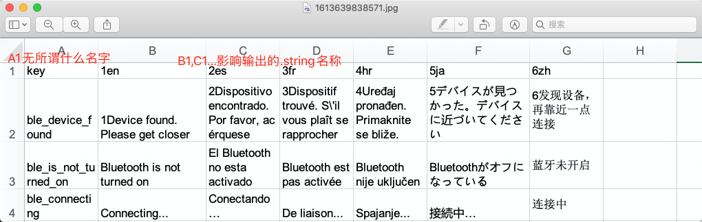
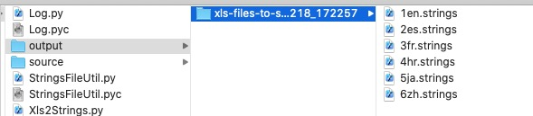

# 支持将 **excel** 文件转换成 **iOS** strings 文件


### 1.检查 pip(python 包管理器)

```
$ pip --version
pip 19.0 from /Library/Python/2.7/site-packages/pip (python 2.7)
```

如果没有安装 pip

```
curl https://bootstrap.pypa.io/get-pip.py -o get-pip.py
sudo python get-pip.py
```

### 2.安装 pyexcelerator

```
sudo pip install pyExcelerator
```


## 使用说明

### 将 **excel** 文件转换成 **iOS** strings 文件
先将excel文档放入source目录内
* excel格式要求如下图


cd到当前目录下执行
```
$ python Xls2Strings.py -f source/ -t output
```

在output文件夹下可以找到相应的string文件


